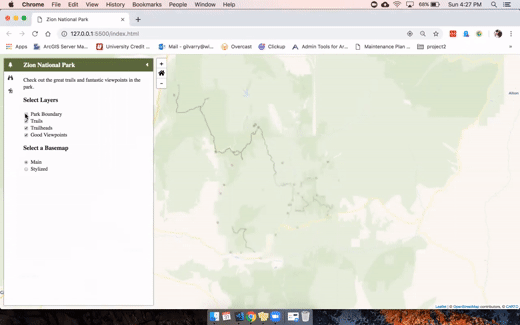

# Zion National Park Trails App

This is a mobile web app for displaying trails and user added points of interest in Zion National Park.

I created it for a capstone course while attending grad school at the University of Wisconsin-Madison in 2019.

## Dependencies

* [Leaflet.js](https://leafletjs.com/) - a library for mobile-friendly interactive maps
* [jQuery](https://jquery.com/) - jQuery
* [Carto.js](https://carto.com/developers/carto-js/v3/) - library that interacts with different CARTO APIs, which this app uses as a backend

## View

You can view the app at https://agilvarry.github.io/Zion-National-Park-Trails/, though the backend is no longer functional.

-OR-

[You can watch a video of me demonstrating the app for my classmates, as depicted in this gif:](https://www.youtube.com/watch?v=pbKZuRzm1hE)

[]
